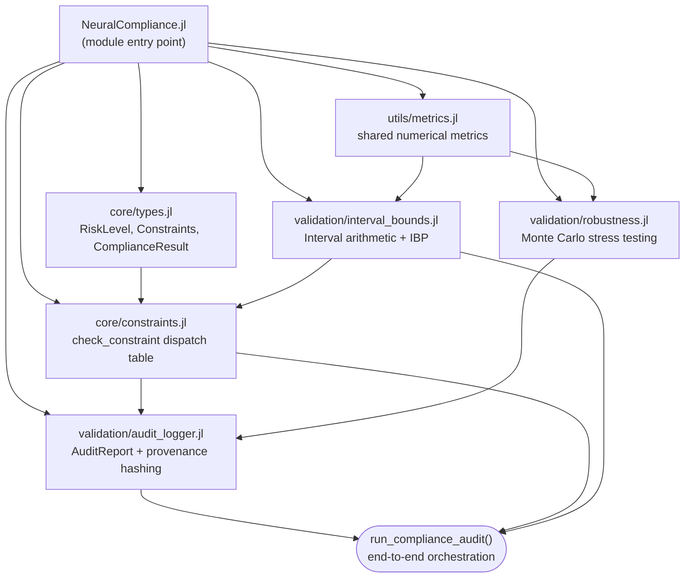
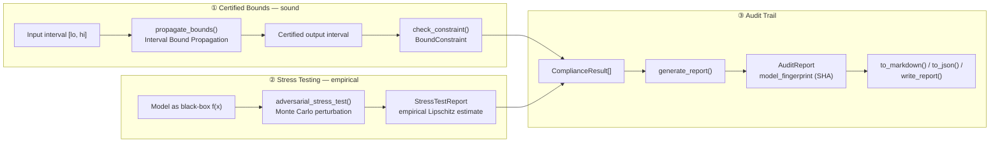
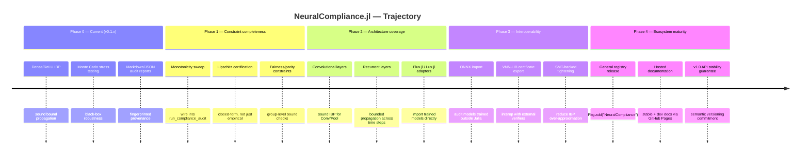

# NeuralCompliance.jl — Project Manifesto

**A Zero-Trust Neural Systems Validation and Compliance Framework**

*Version 0.1.0 · MIT License · Pure Julia*

---

## Abstract

`NeuralCompliance.jl` is a dependency-light, pure-Julia layer for auditing the
behavior of neural networks — and, more generally, arbitrary numerical
functions — against explicit, inspectable mathematical constraints. It is
built for the class of deployment contexts where "the model usually behaves"
is not an acceptable standard of evidence: banking, insurance, and other
regulated financial services, where a learned model's output range,
sensitivity, and monotonicity properties must be *demonstrated*, not assumed.

This document has two purposes. First, it is a technical map of the
repository as it exists today: what each module does, how the three
validation strategies compose, and what guarantees each one actually
provides. Second, it is a forward-looking statement of intent — a roadmap
for where the framework is headed, and, just as importantly, what it
deliberately refuses to claim about itself along the way.

---

## 1. Motivation

Neural networks deployed in regulated environments are typically audited
using one of two unsatisfying approaches: exhaustive manual testing (which
does not scale and cannot cover an input space) or blind trust in aggregate
validation metrics (which say nothing about worst-case behavior). Formal
verification research has produced sound techniques — interval bound
propagation, abstract interpretation, SMT-based reachability analysis — but
these tools rarely reach practitioners working in compliance and
model-risk-management (MRM) functions, and almost never in a form that does
not require a Python/PyTorch/TensorFlow stack.

`NeuralCompliance.jl` exists to close that gap for the Julia ecosystem: a
package that treats "sound" and "empirical" as two distinct, clearly labeled
categories of evidence, and gives both kinds a common reporting format.

---

## 2. Current Architecture

The package has no transitive machine-learning framework dependency. It
relies only on the Julia standard library (`LinearAlgebra`, `Statistics`,
`Dates`, `Printf`, `Random`) plus `SHA.jl` for model fingerprinting.



Include order in the main module is deliberate: types are loaded before any
code that dispatches on them, and `constraints.jl` sits downstream of both
`types.jl` and `interval_bounds.jl` since `check_constraint` methods pattern
match on `Interval` and on the constraint subtypes simultaneously.

---

## 3. The Three Pillars

The framework's central design decision is to keep **sound** guarantees and
**empirical** guarantees strictly separate, and to say so in every relevant
docstring. Conflating the two — reporting a sampled estimate with the
confidence of a certified bound — is treated as the primary failure mode the
package is designed to prevent.



| Strategy | Guarantee | Cost | Applies to |
|---|---|---|---|
| Interval Bound Propagation | Sound — holds for *every* point in the input region | Cheap, closed-form | Dense/ReLU-style architectures with known weights |
| Monte Carlo stress testing | Empirical — holds for *sampled* points only | Scales with `n_samples` | Any Julia function, including black-box/vendor models |
| Audit report | Provenance, not a guarantee itself | Cheap | Aggregates results from either strategy above |

A third constraint family — `MonotonicityConstraint` — is defined in the
type hierarchy but, as of this version, is not wired into
`run_compliance_audit`'s automatic dispatch; it currently requires a manual
sweep workflow described in the docs rather than one-line orchestration.
This is a known, explicitly-labeled gap (see §5).

---

## 4. Design Principles

These four principles, stated in the README, are treated as binding
constraints on future development, not aspirational text:

1. **Soundness is labeled, not implied.** Every public function's docstring
   states outright whether its output is a certified guarantee or an
   empirical estimate.
2. **Minimal dependency surface.** Standard library plus one small,
   widely-audited cryptography package. No transitive ML-framework
   dependencies to audit.
3. **Provenance by default.** Every audit report is content-hashed against
   the model it was generated from (`model_fingerprint`), so a report can
   never be silently reattached to a different model version.
4. **Model-architecture agnosticism where possible.** The empirical
   stress-testing path operates on any Julia function, so the framework
   remains useful even when the underlying architecture is unknown — the
   common case when auditing third-party or vendor models.

---

## 5. Current State (v0.1.0)

| Dimension | Status |
|---|---|
| Core type system | Implemented — `RiskLevel` (ordinal `LOW < MEDIUM < HIGH < CRITICAL`), `AbstractConstraint` hierarchy, `ComplianceResult` |
| Interval Bound Propagation | Implemented for affine (dense) layers with ReLU / sigmoid / tanh bounding |
| Monte Carlo robustness testing | Implemented — configurable norm, sample count, tolerance |
| Audit reporting | Implemented — Markdown and JSON export, SHA-based fingerprinting |
| Constraint coverage | `BoundConstraint` fully wired into orchestration; `LipschitzConstraint` and `MonotonicityConstraint` defined but require manual workflows |
| Test suite | Present — soundness properties, dispatch coverage across constraint families, fingerprint determinism |
| CI | Matrix across Julia 1.9 (LTS) and 1 (stable), on Ubuntu / macOS / Windows, x64 and x86; `JuliaFormatter` (`blue` style) enforced as a required check |
| Documentation | `Documenter.jl`-based, guide + API reference; hosted docs pending first tagged release |
| License | MIT |
| Package registration | Not yet in the General registry — installed via `Pkg.add(url = ...)` |

This is a **v0.1.0, single-maintainer-stage** project: functionally coherent
and tested, but pre-registry, pre-1.0, and scoped to dense/ReLU-family
architectures.

---

## 6. Roadmap

The following is a proposed trajectory inferred from the current
architecture's natural extension points and the disclaimer already present
in the README — not a published, dated commitment. It is organized as
phases rather than a calendar, since a compliance-focused library should be
paced by correctness review, not by release cadence.



### 6.1 Near-term (constraint completeness)

The most immediate gap is internal consistency: `MonotonicityConstraint`
and closed-form `LipschitzConstraint` checking exist as *types* but not as
first-class citizens of `run_compliance_audit`. Closing this gap is
prioritized over adding new architecture support, since an incomplete
dispatch table is a correctness risk in a library whose entire purpose is
trustworthy dispatch.

### 6.2 Mid-term (architecture coverage)

Interval Bound Propagation currently covers affine/dense layers. Extending
sound propagation rules to convolutional and recurrent layers is the
highest-leverage next step for real-world applicability, since production
credit-risk and fraud models are rarely pure MLPs. This will likely require
adapters into `Flux.jl` or `Lux.jl` so that certification can operate
directly on trained model objects rather than requiring users to
re-express weights as `DenseLayer` structs.

### 6.3 Long-term (interoperability and ecosystem)

Longer-term ambitions include ONNX import (so models trained outside Julia
can still be audited), export of certificates in interchange formats such
as VNN-LIB for cross-verification against established tools, and eventual
registration in Julia's General registry with a `v1.0` semantic versioning
commitment — at which point the public API in `export` would be considered
stable.

---

## 7. Explicit Non-Goals

Consistent with the "soundness is labeled, not implied" principle, this
project does **not** claim to be:

- A substitute for legal or regulatory advice. Using it does not, by
  itself, guarantee compliance with SR 11-7, GDPR Article 22, the EU AI
  Act, or any equivalent framework.
- A general-purpose formal verification tool for arbitrary architectures.
  Its sound guarantees are scoped to what interval arithmetic can actually
  certify; everything else is explicitly labeled empirical.
- A drop-in replacement for domain-specific fairness or bias auditing
  tooling, until the fairness-constraint work in Phase 1 lands.

---

## 8. Citation & License

```
NeuralCompliance.jl: A Zero-Trust Neural Systems Validation and
Compliance Framework, v0.1.0, 2026. MIT License.
```

Released under the MIT License. See `CITATION.cff` for machine-readable
citation metadata and `LICENSE` for full license text.

---

*This manifesto describes the repository as of the current commit history
and is intended to be updated as the codebase evolves. It is a project
document, not a regulatory filing.*
