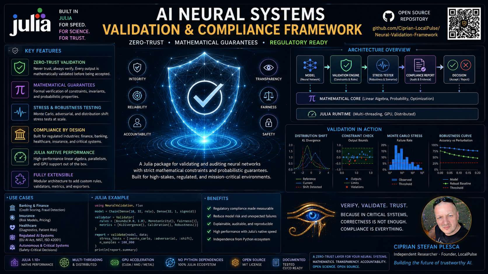

<div align="center">



# NeuralCompliance.jl

### A Zero-Trust Neural Systems Validation and Compliance Framework

*Mathematically certified auditing for neural networks deployed in regulated environments — no Python, no ML framework dependency, pure Julia.*

[](https://github.com/Ciprian-LocalPulse/NeuralCompliance.jl/actions/workflows/CI.yml)
[](https://github.com/Ciprian-LocalPulse/NeuralCompliance.jl/actions/workflows/Documentation.yml)
[](https://codecov.io/gh/Ciprian-LocalPulse/NeuralCompliance.jl)
[](https://Ciprian-LocalPulse.github.io/NeuralCompliance.jl/stable)
[](https://Ciprian-LocalPulse.github.io/NeuralCompliance.jl/dev)
[](LICENSE)
[](https://github.com/invenia/BlueStyle)
[](https://julialang.org)

</div>

---

## Overview

`NeuralCompliance.jl` is a compliance-and-verification layer for
neural networks, written entirely in Julia. It exists to answer a
question that "the model scored 94% accuracy on the holdout set" does
not: **can we *prove* that this model's outputs never violate a given
constraint, over an entire region of input space — not just the
points we happened to test?**

This matters most in regulated deployments — credit underwriting,
insurance pricing, algorithmic trading risk controls, clinical
decision support — where a model-risk-management (MRM) function or an
external auditor needs a reproducible, mathematically grounded
compliance argument, not a sampled accuracy number.

The framework treats every model as **untrusted by default** (hence
"zero-trust"): it does not assume a model behaves well outside the
region it was tested on, and it does not assume vendor-supplied
black-box models behave as documented. Every claim the framework makes
is either a *sound, certified guarantee* (interval bound propagation)
or an *explicitly empirical, best-effort estimate* (Monte Carlo stress
testing) — and the two are never conflated.

## Why Julia, and why no Python dependency

Julia's native, JIT-compiled matrix arithmetic makes it possible to
implement interval-arithmetic bound propagation — which requires
custom numeric types (`Interval`) flowing through ordinary linear
algebra (`W * x`) — at close to native `Float64` matrix-multiply speed,
without hand-writing a C extension. Combined with a standard-library-only
dependency footprint (`LinearAlgebra`, `Dates`, `Random`, `Statistics`,
`Printf`, plus `SHA.jl` for fingerprinting), this keeps the framework's
own audit surface — the thing a security or compliance reviewer would
need to read to trust the tool itself — as small as possible. There is
no `PyCall`, no `PythonCall`, no transitive NumPy/SciPy dependency tree
to vet.

## The three pillars

| Pillar | What it gives you | Where |
|---|---|---|
| **Certified bounds** | Sound, worst-case output guarantees over an entire input *region*, via Interval Bound Propagation | [`src/validation/interval_bounds.jl`](src/validation/interval_bounds.jl) |
| **Empirical stress testing** | Model-agnostic Monte Carlo robustness probing for black-box `f(x) -> y` models | [`src/validation/robustness.jl`](src/validation/robustness.jl) |
| **Fingerprinted audit trail** | SHA-256-fingerprinted, Markdown/JSON compliance reports for MRM documentation packages | [`src/validation/audit_logger.jl`](src/validation/audit_logger.jl) |

## Installation

```julia
using Pkg
Pkg.add(url="https://github.com/Ciprian-LocalPulse/NeuralCompliance.jl")
```

Requires Julia 1.9 or later.

## Quick start

```julia
using NeuralCompliance

# 1. Describe the model as an explicit weight/bias stack.
W1 = [0.8 -1.2 0.3; -0.5 0.9 0.1; 0.4 -0.3 0.7; -0.2 0.6 -0.4]
b1 = [0.1, -0.2, 0.05, 0.0]
W2 = reshape([1.1, -0.8, 0.5, -0.3], 1, 4)
b2 = [-0.2]

layers = [
    DenseLayer(W1, b1, relu),
    DenseLayer(W2, b2, sigmoid_bound),
]

# 2. Declare the constraints a regulator or internal risk team requires.
constraints = AbstractConstraint[
    BoundConstraint("default_probability_in_unit_interval", 0.0, 1.0; risk_level=CRITICAL),
]

# 3. Certify the model over an input region and get a fingerprinted audit report.
report = run_compliance_audit(
    "credit_risk_v1", layers,
    [-2.0, -2.0, -2.0], [2.0, 2.0, 2.0],   # input region
    constraints,
)

println(to_markdown(report))
write_report(report, "credit_risk_v1_audit.json"; format=:json)
```

Run the full annotated walkthrough:

```bash
julia --project=. examples/basic_compliance_check.jl
```

## Certified bounds vs. empirical testing — know which guarantee you're getting

```julia
# SOUND: true for every point in the box, guaranteed by interval arithmetic.
output_intervals = certify_output_bounds(layers, input_lo, input_hi)

# EMPIRICAL: true only for the points that were sampled. Fast, works on
# black-box models, but is not a formal guarantee.
stress_report = adversarial_stress_test(forward_fn, x0, 0.5; n_samples=2000)
```

`NeuralCompliance.jl` deliberately keeps these two code paths distinct
at the type level and in the documentation — a certified `Interval`
result is never silently downgraded to, or confused with, a sampled
`StressTestReport`.

## Project structure

```
NeuralCompliance.jl/
├── .github/workflows/       CI, formatting checks, and docs deployment
├── docs/                    Documenter.jl site (guide + full API reference)
├── src/
│   ├── core/                Types, enums, and constraint definitions
│   ├── validation/          Interval bound propagation, stress testing, audit logging
│   └── utils/                Shared numerical metrics
├── test/                    Full unit test suite (one file per subsystem)
└── examples/                Runnable, annotated end-to-end demo
```

See [`docs/src/guide.md`](docs/src/guide.md) for the complete user
guide and [`docs/src/api.md`](docs/src/api.md) for the full API
reference.

## Design philosophy

1. **Soundness is labeled, not implied.** Every function's docstring
   states explicitly whether it produces a certified (sound) guarantee
   or an empirical (sampled) estimate.
2. **Minimal dependency surface.** Standard library plus one small,
   widely-audited crypto package (`SHA.jl`). No transitive ML
   framework dependencies to audit.
3. **Provenance by default.** Every audit report is content-hashed
   against the model it was generated from, so a report can never be
   silently reattached to a different model version.
4. **Model-architecture agnostic where possible.** The empirical
   stress-testing path works on *any* Julia function, so the framework
   is useful even for third-party or vendor black-box models where the
   architecture is unknown.

## Testing

```bash
julia --project=. -e 'using Pkg; Pkg.test()'
```

The test suite exercises interval arithmetic soundness properties
(e.g. tighter input regions never produce wider certified output
intervals), constraint-checking dispatch across all three constraint
families, the Monte Carlo stress-testing pipeline, and audit-report
provenance/fingerprint determinism.

## Contributing

Contributions are welcome — see [CONTRIBUTING.md](CONTRIBUTING.md) for
development setup, code style (JuliaFormatter, `blue` style), and pull
request expectations. This is a compliance library: correctness bugs
in the bound-propagation logic have outsized real-world consequences,
so new validation logic must ship with tests and, where applicable, a
soundness justification.

## Citation

If you use `NeuralCompliance.jl` in academic or industrial work, please
cite it using the metadata in [`CITATION.cff`](CITATION.cff).

## Support

If this project is useful to you, see [FUNDING.md](FUNDING.md) for ways
to support continued development — or simply star the repository,
report bugs, or open a pull request.

## License

Released under the [MIT License](LICENSE).

## Disclaimer

`NeuralCompliance.jl` is a mathematical verification *tool*. It does
not constitute legal or regulatory advice, and using it does not by
itself guarantee compliance with any specific regulation (e.g. SR
11-7, GDPR Article 22, the EU AI Act, or equivalent frameworks in
other jurisdictions). Consult qualified legal and model-risk
management professionals for your specific regulatory context.
