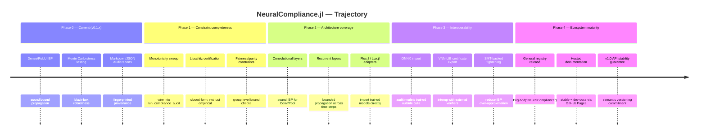

# Roadmap

This document describes the intended trajectory of `NeuralCompliance.jl`,
organized as **phases** rather than a release calendar. As a compliance-
focused library, the pace of new work here is set by correctness review —
new validation logic ships with tests and, where applicable, a soundness
justification — not by a fixed schedule.

Nothing below is a commitment with a date attached. It is a statement of
priorities, and it will be revised as the project evolves and as the
community using it surfaces real requirements.

---

## Phase 0 — Current state (v0.1.x)

What exists and is tested today:

- Sound Interval Bound Propagation (IBP) for affine/dense layers, with
  bounding rules for ReLU, sigmoid, and tanh.
- Model-agnostic Monte Carlo stress testing (`adversarial_stress_test`) for
  black-box functions, with configurable norm, sample count, and tolerance.
- Fingerprinted audit reports (`AuditReport`) with Markdown and JSON export.
- `BoundConstraint` fully wired into `run_compliance_audit`.

Known, explicitly-labeled gap: `MonotonicityConstraint` and closed-form
`LipschitzConstraint` checking exist as types in `core/types.jl` but are not
yet dispatched automatically by `run_compliance_audit` — they currently
require a manual workflow. See Phase 1.

## Phase 1 — Constraint completeness

Priority: correctness of the existing type system before new surface area.

- [ ] Wire `MonotonicityConstraint` into `run_compliance_audit` via a sweep
      workflow (sample along an axis, verify sign of the delta).
- [ ] Closed-form Lipschitz bound certification, as an alternative to the
      current empirical-only estimate from stress testing.
- [ ] Group-level fairness/parity constraints (e.g. demographic parity,
      equalized bound checks across sub-populations), following the same
      "labeled sound vs. empirical" convention as everything else.

## Phase 2 — Architecture coverage

Priority: real-world applicability beyond pure MLPs.

- [ ] Sound IBP rules for convolutional and pooling layers.
- [ ] Bounded propagation across time steps for recurrent layers.
- [ ] `Flux.jl` / `Lux.jl` adapters, so certification can run directly
      against a trained model object instead of requiring users to
      re-express weights as `DenseLayer` structs by hand.

## Phase 3 — Interoperability

Priority: usefulness beyond models trained in Julia.

- [ ] ONNX import, so models trained outside Julia can still be audited.
- [ ] Certificate export in an interchange format (VNN-LIB) for
      cross-verification against established external tools.
- [ ] SMT-backed tightening to reduce over-approximation inherent to
      interval arithmetic, where it materially affects certified bounds.

## Phase 4 — Ecosystem maturity

Priority: making the package easy and safe to depend on.

- [ ] Registration in Julia's General registry (`Pkg.add("NeuralCompliance")`
      instead of a URL install).
- [ ] Hosted stable + dev documentation via GitHub Pages
      (`Documenter.jl` deploy already scaffolded in
      `.github/workflows/Documentation.yml`).
- [ ] `v1.0` release with a semantic versioning commitment on the public
      API listed in `src/NeuralCompliance.jl`'s `export` block.

---

## Non-goals

To keep this roadmap honest about scope, the following are explicitly
**not** planned, regardless of phase:

- Replacing legal or regulatory review. Passing every check in this
  package does not by itself constitute compliance with SR 11-7, GDPR
  Article 22, the EU AI Act, or equivalent frameworks.
- Becoming a general-purpose formal verification framework for arbitrary
  architectures beyond what interval arithmetic (and, later, SMT-assisted
  tightening) can soundly certify.
- Silently blurring the line between sound and empirical guarantees, at
  any phase, for any reason — this is the one design principle the
  project treats as non-negotiable.

---

## Contributing to the roadmap

If you have a concrete use case that isn't reflected above — a
verification technique, an architecture family, or an interoperability
target — open an issue. See [CONTRIBUTING.md](CONTRIBUTING.md) for
development setup and code style expectations.
