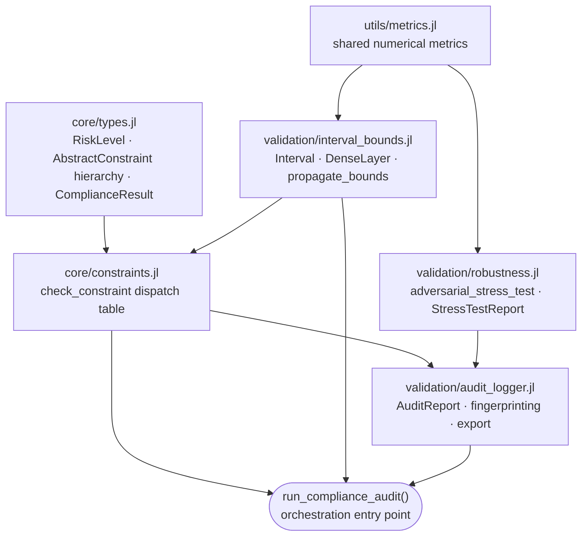

# NeuralCompliance.jl

### A Zero-Trust Framework for Certified and Empirical Validation of Neural Systems in Regulated Environments

**Ciprian Ștefan Pleșca**
*Independent Researcher*
`github.com/Ciprian-LocalPulse/NeuralCompliance.jl`

Version 0.1.0 — 2026 — MIT License

> This is the academic/technical whitepaper. For installation and usage,
> see the [README](README.md); for what's planned next, see the
> [ROADMAP](ROADMAP.md).

---

## Abstract

Neural networks deployed in financial services, insurance, and other
regulated domains are subject to a standard of evidence that ordinary
validation accuracy does not meet: a demonstrable, worst-case guarantee on
output behavior, not merely a statistically favorable sample of it. We
present `NeuralCompliance.jl`, a dependency-light, pure-Julia framework that
formalizes the distinction between two categories of evidence — *sound*
guarantees, obtained via Interval Bound Propagation (IBP), and *empirical*
guarantees, obtained via Monte Carlo perturbation analysis — and unifies
both under a single, cryptographically fingerprinted audit-report format.
We give a formal treatment of the interval arithmetic used to certify
output bounds, state and justify its soundness property, describe the
constraint-checking semantics that connect certified evidence to
pass/fail compliance decisions, and characterize the current scope and
limitations of the implementation. We conclude with a staged roadmap
toward broader architectural coverage and formal-verification
interoperability.

**Keywords:** neural network verification, interval bound propagation,
formal methods, model risk management, adversarial robustness, audit
provenance, Julia.

---

## 1. Introduction

The deployment of learned models in regulated financial contexts —
underwriting, credit scoring, fraud detection, algorithmic trading
controls — is typically governed by model-risk-management (MRM)
frameworks such as the U.S. Federal Reserve's SR 11-7 guidance, and
increasingly by statutory regimes such as the EU AI Act and GDPR Article
22's provisions on automated decision-making. These frameworks share a
common demand: a model's behavior must be *demonstrable* within a defined
operating envelope, not merely observed to be well-behaved on a held-out
test set.

This demand is in tension with how neural networks are ordinarily
validated. Standard machine-learning evaluation reports accuracy,
precision/recall, or loss on a finite sample; it says nothing about
behavior on inputs the sample did not cover, and nothing at all about
worst-case behavior over a continuous input region. Formal verification
research has developed techniques — abstract interpretation, interval
bound propagation, SMT-based reachability analysis — that close this gap
for restricted model classes, but this body of work has largely remained
confined to the verification-research community and to Python-based
tooling tied to specific deep-learning frameworks.

`NeuralCompliance.jl` is written to make one specific technique —
sound interval bound propagation, in the tradition of Gowal et al.
(2018) and the broader reachability-analysis literature — directly
usable from Julia, without a transitive dependency on any
machine-learning framework, and packaged in a form a compliance or
model-risk function can consume: a fingerprinted, human- and
machine-readable audit report.

### 1.1 Contributions

This work makes the following contributions:

1. A formal, closed-form characterization of a **sound** interval bound
   propagation procedure for affine/dense architectures with monotonic or
   ReLU-family activations, implemented using a numerically stable
   center–radius decomposition (§4).
2. A constraint-checking semantics that cleanly separates *certified*
   evidence (interval-derived) from *empirical* evidence (sample-derived),
   enforced at the type level rather than by convention (§5).
3. A Monte Carlo stress-testing procedure for architecture-agnostic,
   black-box robustness estimation, applicable when model internals are
   unavailable (§6).
4. A provenance model in which every audit report is bound to a
   cryptographic fingerprint of the model it was generated from, so that
   a compliance artifact cannot be silently detached from the model
   version it describes (§7).
5. An explicit statement of the current scope, known gaps, and threats to
   validity of the implementation (§10), and a staged roadmap for closing
   them (§11).

---

## 2. Background and Related Work

**Interval Bound Propagation (IBP).** IBP computes, for each layer of a
network, an interval over-approximation of the set of possible
activations, given an interval over the layer's inputs. Propagated
layer-by-layer, this yields a certified interval over the network's
output that is guaranteed to contain the image of every point in the
input region. IBP trades tightness for computational cost: it is
$O(nm)$ per affine layer (matching ordinary matrix–vector multiplication
cost) but, because it does not track correlations between coordinates
introduced by earlier layers, its bounds can be loose relative to
exact reachable sets. This trade-off is well documented in the
verification literature; `NeuralCompliance.jl` inherits it by design,
in exchange for a certification procedure cheap enough to run as part
of an ordinary CI or audit pipeline rather than requiring a dedicated
verification toolchain.

**Empirical robustness testing.** Where IBP requires white-box access to
model weights, Monte Carlo perturbation analysis treats the model as an
opaque function and estimates local sensitivity by sampling. This is the
appropriate — and often the only available — tool when auditing
third-party or vendor-supplied models, a common situation in
vendor-risk assessment. It provides no soundness guarantee: absence of
a violation among sampled points is evidence, not proof, of compliance.

**Model risk management context.** Regulatory guidance in this space
(e.g., SR 11-7-style frameworks) generally requires that a model's
limitations be documented alongside its capabilities, and that validation
evidence be traceable to a specific, version-identified model artifact.
`NeuralCompliance.jl`'s provenance model (§7) is designed directly against
this requirement.

---

## 3. System Design and Architecture

The system is organized as six modules with a strict dependency order,
reflecting the constraint that types must be defined before any code
that dispatches on them.

No module in this graph depends on a machine-learning framework; the
only third-party dependency in the entire package is `SHA.jl`, used
exclusively for model fingerprinting (§7).

---

## 4. Formal Treatment of Interval Bound Propagation

### 4.1 Interval arithmetic

Let $[a] = [a^-, a^+] \subset \mathbb{R}$ denote a closed real interval,
$a^- \le a^+$. The implementation defines elementwise interval
arithmetic in the standard way:

$$
[a] + [b] = [a^- + b^-,\; a^+ + b^+]
$$

$$
[a] \times [b] = \big[\min(S),\, \max(S)\big], \quad
S = \{a^- b^-,\ a^- b^+,\ a^+ b^-,\ a^+ b^+\}
$$

Scalar multiplication is handled as a monotonicity-aware special case
($k \ge 0$ preserves orientation; $k < 0$ swaps the bounds) rather than
via the general four-candidate product, which is both cheaper and
avoids an unnecessary `min`/`max` over four values when the sign of the
scalar is already known statically.

### 4.2 Elementwise activation bounds

For a monotonic function $\phi$ (sigmoid, tanh), the image of an
interval under $\phi$ is exactly

$$
\phi\big([a^-, a^+]\big) = \big[\phi(a^-),\, \phi(a^+)\big],
$$

which is *tight*, not merely sound — monotonicity means no
over-approximation is introduced at this step. For ReLU,

$$
\mathrm{ReLU}\big([a^-, a^+]\big) = \big[\max(a^-, 0),\, \max(a^+, 0)\big],
$$

which is likewise the exact image, since ReLU is monotonic non-decreasing
on $\mathbb{R}$.

### 4.3 Affine propagation via center–radius decomposition

The central primitive is propagation of an interval vector
$\mathbf{x} \in ([\mathbb{R}])^n$ through an affine map
$\mathbf{y} = W\mathbf{x} + \mathbf{b}$, $W \in \mathbb{R}^{m \times n}$.
Rather than computing the four-candidate product coordinate-by-coordinate
(which is both more expensive and more prone to floating-point
cancellation for wide intervals), the implementation uses the classical
center–radius reformulation. Writing each input interval as
$x_i = c_i \pm r_i$ with $c_i = \mathrm{mid}(x_i)$ and
$r_i = \mathrm{width}(x_i)/2$:

$$
\mathbf{c}_y = W\mathbf{c}_x + \mathbf{b}, \qquad
\mathbf{r}_y = |W|\,\mathbf{r}_x,
$$

where $|W|$ denotes the elementwise absolute value of $W$, and the
certified output interval for coordinate $i$ is
$y_i = [\,(c_y)_i - (r_y)_i,\ (c_y)_i + (r_y)_i\,]$.

**Proposition (Soundness).** For every $\mathbf{x}_0$ with
$x_{0,i} \in [x_i^-, x_i^+]$ for all $i$, the true output
$W\mathbf{x}_0 + \mathbf{b}$ satisfies
$(W\mathbf{x}_0 + \mathbf{b})_i \in y_i$ for every coordinate $i$.

*Justification.* Fix a coordinate $i$ and write
$(W\mathbf{x}_0)_i = \sum_j W_{ij} x_{0,j}$. Since
$x_{0,j} = c_{x,j} + \delta_j$ with $|\delta_j| \le r_{x,j}$,

$$
(W\mathbf{x}_0)_i = \sum_j W_{ij} c_{x,j} + \sum_j W_{ij}\delta_j
= (Wc_x)_i + \sum_j W_{ij}\delta_j.
$$

By the triangle inequality,
$\left|\sum_j W_{ij}\delta_j\right| \le \sum_j |W_{ij}|\,r_{x,j} = (|W|r_x)_i$,
hence $(W\mathbf{x}_0)_i \in [(Wc_x)_i - (|W|r_x)_i,\ (Wc_x)_i + (|W|r_x)_i]$.
Adding $\mathbf{b}$ and combining with the exact (monotonic) or sound
(ReLU) activation bounds of §4.2 at each layer, and composing over the
finite sequence of layers, establishes the proposition for the full
network by induction on layer depth. $\blacksquare$

This is the standard soundness argument for interval-based reachability
analysis; it is reproduced here in the notation matching the concrete
implementation (`affine_propagate`, `propagate_bounds`) so that the code
and the guarantee it is claimed to provide can be checked against one
another directly.

### 4.4 Complexity and known conservatism

Each affine layer costs $O(nm)$ — one matrix–vector product for the
center, one for the radius — matching ordinary forward-pass cost up to a
constant factor. The known cost of this efficiency is *dependency
over-approximation*: because the method propagates a single interval per
coordinate rather than tracking a symbolic or zonotope-style
representation of inter-coordinate correlation, certified bounds can be
strictly looser than the true reachable set, especially through deep
networks. This is a standard, well-understood limitation of IBP relative
to more expensive verification techniques (e.g., SMT-based or
mixed-integer programming approaches), and is treated in §10 as a
scoped, documented trade-off rather than a defect.

---

## 5. Constraint Semantics

`AbstractConstraint` is the supertype for all checkable properties.
Three concrete families are defined:

| Constraint | Required evidence | Guarantee class |
|---|---|---|
| `BoundConstraint` | `Interval` (from §4) **or** raw output vector | Sound (interval form) / empirical (vector form) |
| `LipschitzConstraint` | Estimated Lipschitz constant | Currently empirical only (§10) |
| `MonotonicityConstraint` | Directional sweep evidence | Defined; not yet auto-dispatched (§10) |

The dispatch table in `core/constraints.jl` is deliberately
overloaded on evidence type rather than gated by a runtime flag: calling
`check_constraint(c::BoundConstraint, output::Interval)` is a distinct,
statically-selected method from
`check_constraint(c::BoundConstraint, outputs::AbstractVector{<:Real})`,
so that a caller cannot accidentally request the sound path and silently
receive empirical evidence, or vice versa. This is the concrete
enforcement mechanism behind the design principle "soundness is labeled,
not implied": the distinction is a type-level fact, not a documentation
convention.

Each check returns a `ComplianceResult`, aggregating a pass/fail flag, a
risk level drawn from the ordinal scale $\text{LOW} < \text{MEDIUM} <
\text{HIGH} < \text{CRITICAL}$, and a structured evidence record
(certified bounds, sample statistics, or method identifier as
applicable).

---

## 6. Empirical Robustness Testing

For a black-box function $f: \mathbb{R}^n \to \mathbb{R}^m$, a base point
$x_0$, and a perturbation radius $\varepsilon$, the stress-testing
procedure draws $N$ samples $x_1, \dots, x_N$ within the chosen norm ball
around $x_0$ and evaluates

$$
d_k = \lVert f(x_k) - f(x_0) \rVert, \qquad
\hat{L} = \max_k \frac{d_k}{\lVert x_k - x_0 \rVert},
$$

reporting the maximum and mean observed output deviation and the
empirical Lipschitz estimate $\hat L$ as a `StressTestReport`. Unlike
§4's certified bounds, $\hat L$ is a statistic of the sampled set: it
provides no guarantee about behavior at unsampled points, and is
reported as such throughout the codebase and its documentation. This
procedure requires no access to $f$'s internals and is therefore the
only available option, within the current framework, for auditing
models whose architecture or weights are not exposed to the auditor.

---

## 7. Audit and Provenance

An `AuditReport` aggregates a batch of `ComplianceResult`s together with
a `model_hash`, computed via SHA over a canonical serialization of the
model artifact being audited (weights, or a user-supplied `model_data`
argument for opaque models), and a generation timestamp. This binds a
compliance artifact to a specific model version at the point evidence
was generated: a report cannot be reattached, even inadvertently, to a
different model artifact without the hash mismatch being detectable.
Reports export to both Markdown (for human review and MRM documentation
packages) and JSON (for machine ingestion by downstream compliance
tooling), via `to_markdown` and `to_json`.

---

## 8. Implementation

The framework is implemented in pure Julia with no dependency on any
machine-learning framework. The only third-party dependency is
`SHA.jl`. Code style is enforced via `JuliaFormatter` in the `blue`
style, as a required continuous-integration check, alongside a version
matrix spanning Julia 1.9 (LTS) and the current stable 1.x release
across Linux, macOS, and Windows, on both x64 and x86 where applicable.

---

## 9. Evaluation Methodology

The accompanying test suite exercises three classes of property:

1. **Soundness invariants** of interval arithmetic — e.g., that a
   tighter input interval never yields a wider certified output interval
   than a looser one, a monotonicity property any correct IBP
   implementation must satisfy.
2. **Dispatch coverage** — that `check_constraint` resolves correctly
   across all implemented constraint/evidence type pairs.
3. **Provenance determinism** — that identical model artifacts yield
   identical fingerprints, and that the fingerprint changes under any
   modification to the audited artifact.

This is a correctness test suite, not a benchmark suite: the project
does not currently publish comparative tightness or runtime benchmarks
against alternative verification tools, a gap noted explicitly in §10.

---

## 10. Limitations and Threats to Validity

In keeping with the project's stated principle that soundness claims
must be explicit, the following limitations are stated directly rather
than left implicit:

- **Architecture scope.** Sound propagation is currently implemented
  only for affine (dense) layers with monotonic or ReLU-family
  activations. Convolutional and recurrent architectures are not yet
  covered (see roadmap, §11).
- **Conservatism.** As discussed in §4.4, IBP bounds are sound but not
  tight; certified intervals may be substantially wider than the true
  reachable set, particularly for deep networks, which can produce
  false negatives on compliance checks that would pass under a tighter
  (and more expensive) verification method.
- **Partial constraint coverage.** `MonotonicityConstraint` and a
  closed-form (as opposed to empirical) `LipschitzConstraint` are
  defined in the type system but not yet wired into the automatic
  `run_compliance_audit` dispatch path.
- **No independent benchmark comparison.** Certified-bound tightness and
  runtime have not been benchmarked against established external
  verification tools; such a comparison would strengthen confidence in
  the practical utility of the conservatism trade-off described in §4.4.
- **Not a substitute for legal or regulatory review.** Passing every
  check this framework can express does not, by itself, constitute
  compliance with SR 11-7, GDPR Article 22, the EU AI Act, or any
  equivalent regime. The framework produces mathematical evidence for
  use *within* a compliance process, not a legal determination.

---

## 11. Roadmap

Future work is organized in four phases, prioritized by correctness
review rather than by calendar: (1) completing the existing constraint
type system's dispatch coverage (monotonicity, closed-form Lipschitz,
fairness/parity constraints); (2) extending sound propagation to
convolutional and recurrent architectures, with `Flux.jl`/`Lux.jl`
adapters for direct import of trained models; (3) interoperability with
external verification ecosystems via ONNX import and VNN-LIB certificate
export, and SMT-assisted tightening of currently conservative bounds;
and (4) ecosystem maturity — General registry publication, hosted
documentation, and a `v1.0` semantic versioning commitment on the public
API. A detailed, itemized version of this roadmap is maintained
separately in `ROADMAP.md`.

---

## 12. Conclusion

`NeuralCompliance.jl` demonstrates that a useful subset of formal
neural-network verification — sound interval bound propagation, in
particular — can be made available to Julia users as a
dependency-light library, with a constraint-checking and audit-reporting
layer designed specifically for the evidentiary requirements of
regulated deployment contexts. Its central methodological commitment —
that certified and empirical evidence must be distinguishable at the
type level, not merely by convention — is, in the author's view, more
consequential to the project's usefulness in a compliance setting than
any single verification technique it implements. The current
implementation is scoped, tested, and limited in ways stated explicitly
in §10; the roadmap in §11 describes the intended path toward closing
those gaps without relaxing that commitment.

---

## References

1. Gowal, S., et al. (2018). *On the Effectiveness of Interval Bound
   Propagation for Training Verifiably Robust Models.* arXiv preprint.
2. Board of Governors of the Federal Reserve System & Office of the
   Comptroller of the Currency (2011). *SR 11-7: Guidance on Model Risk
   Management.*
3. European Union (2016). *General Data Protection Regulation*, Article
   22 (Automated individual decision-making, including profiling).
4. European Union (2024). *Artificial Intelligence Act.*
5. NeuralCompliance.jl source repository:
   `github.com/Ciprian-LocalPulse/NeuralCompliance.jl`.

---

## Appendix A — Notation Summary

| Symbol | Meaning |
|---|---|
| $[a] = [a^-, a^+]$ | Closed real interval |
| $\mathrm{mid}([a])$ | Interval midpoint, $(a^- + a^+)/2$ |
| $\mathrm{width}([a])$ | Interval width, $a^+ - a^-$ |
| $W, \mathbf{b}$ | Affine layer weight matrix and bias vector |
| $\mathbf{c}_x, \mathbf{r}_x$ | Center and radius vectors of an interval vector $\mathbf{x}$ |
| $\hat{L}$ | Empirical (sampled) Lipschitz estimate |
| $\varepsilon$ | Perturbation radius for stress testing |

---

*This whitepaper describes `NeuralCompliance.jl` as of the commit
history current at time of writing. It is a technical and methodological
document, not a regulatory filing, and does not constitute legal advice.*
